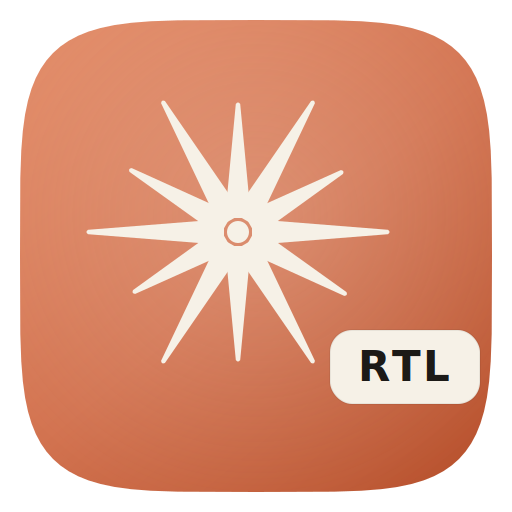

<div align="center">



# Claude Desktop RTL

**Real-time right-to-left text support for [Claude Desktop](https://claude.ai/download) on macOS.**
Hebrew · Arabic · Persian — in the chat box *and* in Claude's replies. Code and math stay LTR. Your original app is never touched.

[](#requirements)
[](#why-a-copy-instead-of-patching-in-place)
[](patch.sh)
[](LICENSE)

</div>

---

## Install in 30 seconds

One command — no `git`, no manual download:

```bash
curl -fsSL https://raw.githubusercontent.com/ali-master/claude-app-macos-rtl/master/install.sh | bash
```

That's it. The script fetches the repo, builds a patched copy at `~/Applications/Claude-RTL.app`, and launches it. **Your original `/Applications/Claude.app` is never modified.**

**Preview first (recommended)** — see exactly what it would do, changing nothing:

```bash
curl -fsSL https://raw.githubusercontent.com/ali-master/claude-app-macos-rtl/master/install.sh | bash -s -- --dry-run
```

Any `patch.sh` flag can be forwarded after `bash -s --` (e.g. `--font Vazirmatn`).

<details>
<summary><strong>Prefer to clone it yourself?</strong></summary>

<br/>

```bash
git clone https://github.com/ali-master/claude-app-macos-rtl.git
cd claude-app-macos-rtl
./patch.sh --install
```

Downloaded the ZIP instead of cloning? Run `chmod +x patch.sh` first.

</details>

## Why

Claude Desktop left-aligns Hebrew, Arabic, and Persian — making them awkward to read and type. This patch fixes the direction in real time, without forking the app or breaking auto-updates.

| | Without patch | With patch |
|---|:---|:---|
| **Alignment** | RTL text jammed to the left | RTL text properly right-aligned |
| **Example** | `שלום עולם` / `مرحبا بالعالم` / `سلام دنیا` stuck to the left | `שלום עולם` / `مرحبا بالعالم` / `سلام دنیا` aligned to the right |

## Features

- 🔄 **Live detection** — chat input flips to RTL the moment you type Hebrew/Arabic/Persian
- 💬 **Streaming-aware** — Claude's responses are aligned in real time as they stream in
- 🧮 **Code & math safe** — `<pre>`, `<code>`, KaTeX, MathJax & MathML always stay LTR
- 🧠 **Smart mixed content** — 3-layer detection handles sentences that blend RTL and English
- 🅰️ **Optional RTL fonts** — opt in to bundled Vazirmatn / Estedad, or any installed font
- 🛡️ **Non-destructive** — patches a *copy*; the original app and its auto-updates are untouched
- 🏷️ **Distinct icon** — the patched app wears an `RTL` badge so you never mix them up

## Usage

```bash
./patch.sh --install      # Build the patched copy (re-run to update after Claude updates)
./patch.sh --uninstall    # Remove the patched copy (original untouched)
./patch.sh --status       # Show installed versions + ASAR fuse state
./patch.sh                # Interactive menu
./patch.sh --help         # Full help
```

### Optional: a dedicated RTL font

By default the patch only changes **direction**, not the font. To also swap the font for RTL text (handy if the default has weak Persian/Arabic glyphs), opt in with `--font`:

```bash
./patch.sh --install --font Vazirmatn    # bundled, OFL — Persian/Arabic + Latin
./patch.sh --install --font Estedad       # bundled, OFL — 9 weights, Thin → Black
./patch.sh --install --font "B Nazanin"   # any font already installed on your system
```

Bundled fonts are embedded as base64 `data:` URIs (Claude's CSP blocks external font loads), so they work even when not installed system-wide. Drop your own `.woff2/.woff/.ttf/.otf` into `fonts/` — named so they start with the family name — to bundle a different one. Code blocks always stay monospace.

> **Hebrew users:** Vazirmatn/Estedad ship no Hebrew glyphs — Hebrew falls back to the system font. Bundle a Hebrew-friendly family (Heebo, Rubik, Assistant…) in `fonts/` for full coverage.

## Requirements

- **macOS** (tested on Sequoia 15 / Tahoe 26)
- **Claude Desktop** at `/Applications/Claude.app`
- **Node.js 16+** — for `npx`, which fetches `@electron/asar` & `@electron/fuses` on demand ([nodejs.org](https://nodejs.org/) or `brew install node`)

## After Claude updates

Anthropic's auto-updater only touches the **original** app. Your patched copy is independent and won't auto-update — just re-run the patcher to rebuild it from the new version:

```bash
./patch.sh --install
```

Keep the original `Claude.app` for updates; let it update itself, then re-patch.

## How it works

<details>
<summary><strong>The patching pipeline (click to expand)</strong></summary>

<br/>

1. **Copy** `/Applications/Claude.app` → `~/Applications/Claude-RTL.app`
2. **Extract** the Electron `app.asar` archive
3. **Prepend** the RTL detection JS into `.vite/build/*.js` renderer files (the main-process entry is skipped — injecting it black-screens launch)
4. **Repack** the archive
5. **Disable** the `EnableEmbeddedAsarIntegrityValidation` fuse — required, since the modified archive has a new hash that Electron would otherwise reject at startup
6. **Re-sign** ad-hoc (the original signature is invalidated by the changes; ad-hoc signing is what lets macOS launch the modified bundle)

The original `/Applications/Claude.app` is **never touched.**

</details>

### Why a copy instead of patching in place?

Unlike the [Windows version](https://github.com/shraga100/claude-desktop-rtl-patch), the macOS patcher builds a separate copy — which is strictly safer:

- **No `sudo`** — `~/Applications/` is user-writable; the script never needs elevated privileges
- **Original stays intact** — `/Applications/Claude.app` is root-owned and App-Management-protected; it's left alone
- **Auto-updates keep working** — Anthropic's updates flow to the original without conflict
- **Trivial rollback** — if anything breaks, delete the copy; the original is still there

## Uninstall

```bash
./patch.sh --uninstall
```

Removes `~/Applications/Claude-RTL.app`. The original is unaffected.

## FAQ

**macOS asks to re-approve "Claude Safe Storage" on first launch.** Expected — a different code signature means macOS re-prompts for Keychain access. A one-time blank window on first launch can also happen. Neither is a bug.

**Does this touch my real Claude app or Claude Code CLI?** No. Every operation is scoped to the `Claude-RTL.app` copy.

## Credits & License

RTL detection logic originates from the upstream Windows project [shraga100/claude-desktop-rtl-patch](https://github.com/shraga100/claude-desktop-rtl-patch); this repo's value-add is the macOS patching pipeline. Bundled fonts (Vazirmatn, Estedad) are OFL-licensed — see [`fonts/OFL.txt`](fonts/OFL.txt).

Licensed under [MIT](LICENSE) · © 2025 Ali Torki

<div align="center"><sub>Not affiliated with Anthropic. "Claude" is a trademark of Anthropic.</sub></div>

---

<div align="center">

**[⬆ Back to Top](#claude-desktop-rtl)**

Built with ❤️ by [Ali Torki](https://github.com/ali-master)

</div>
